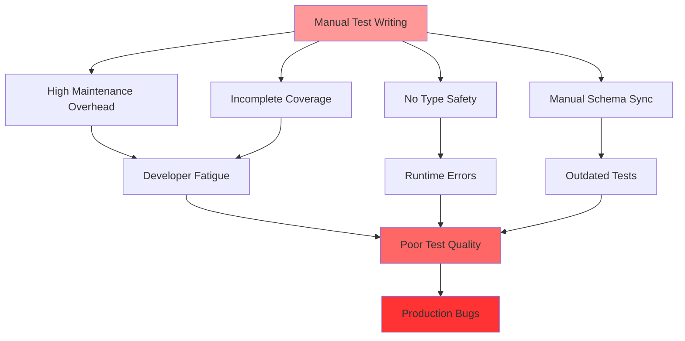
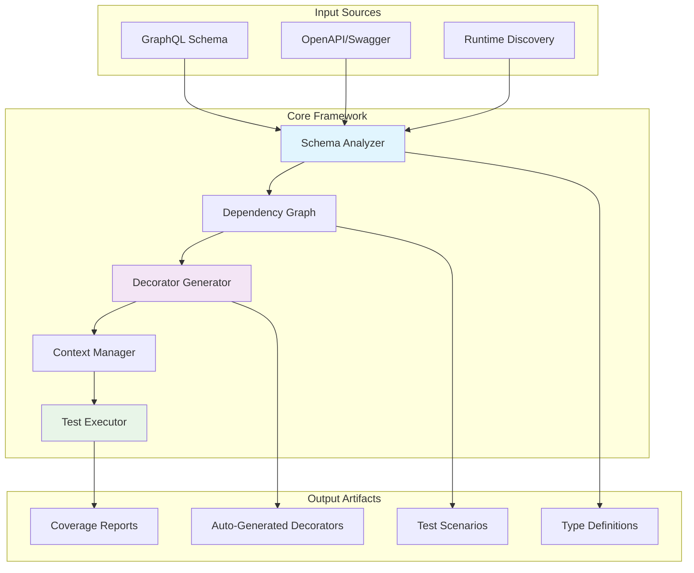
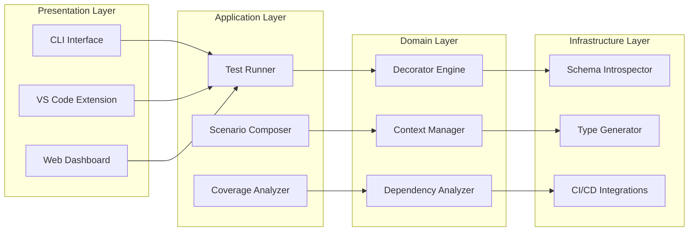
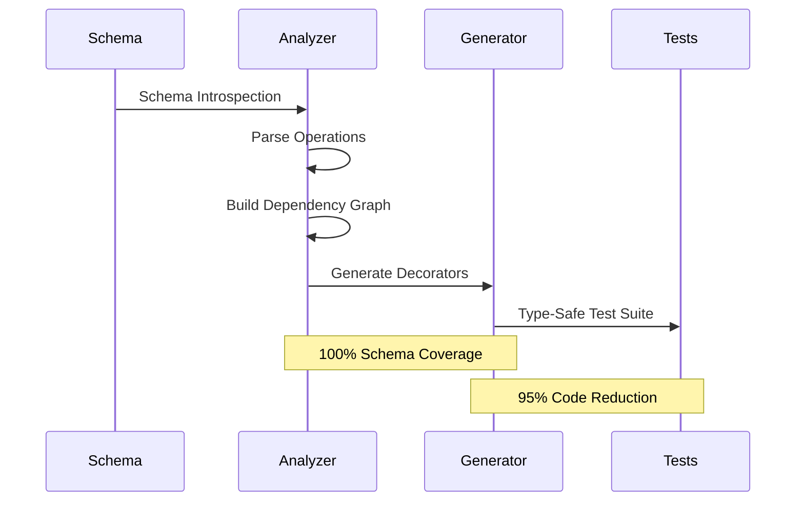
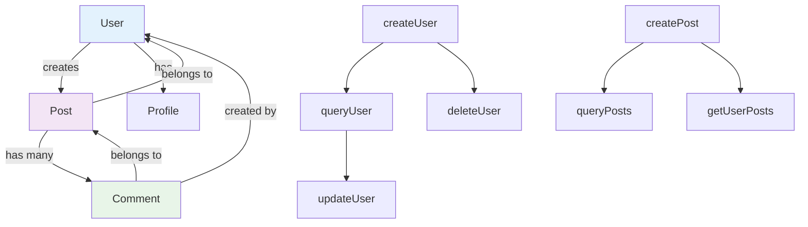
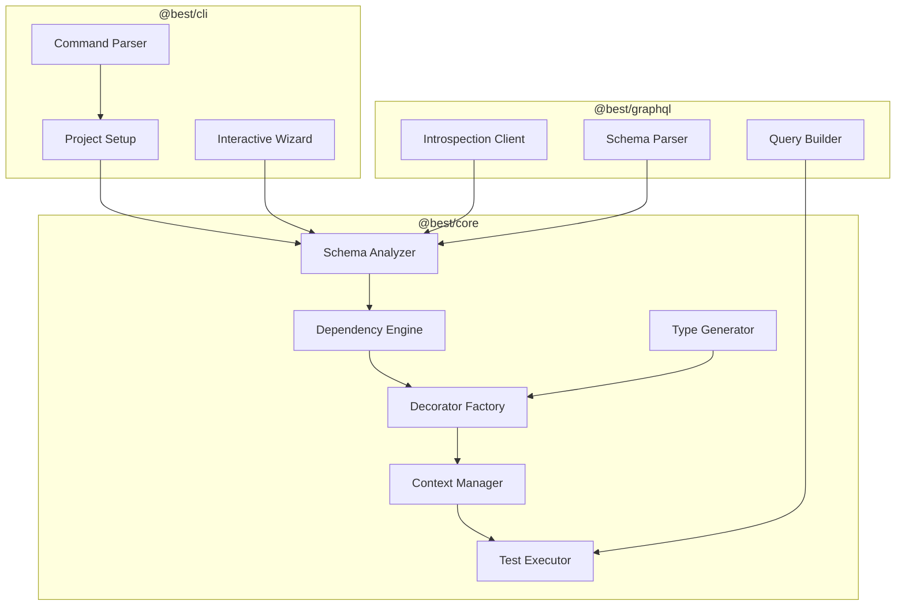
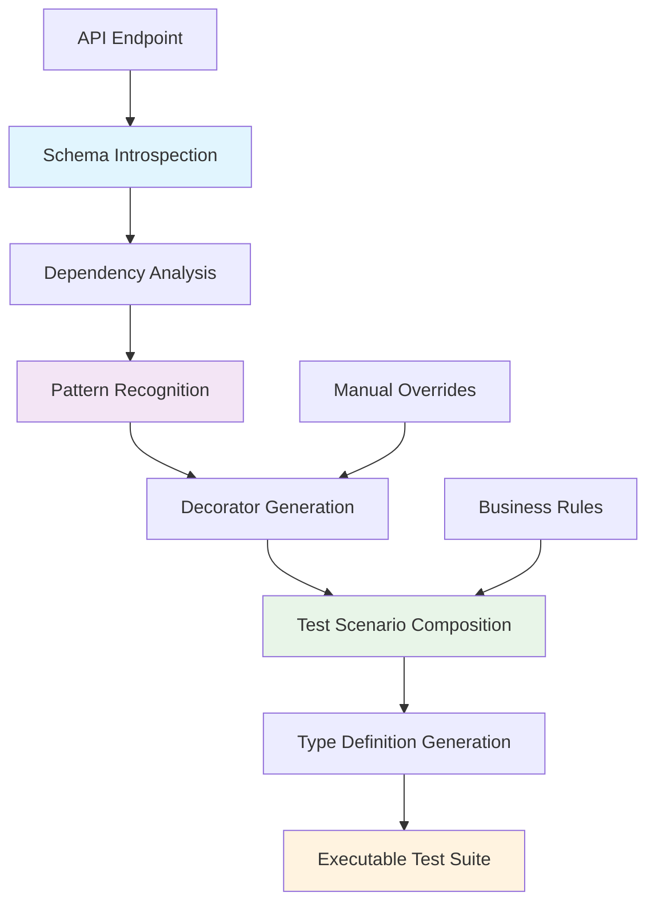
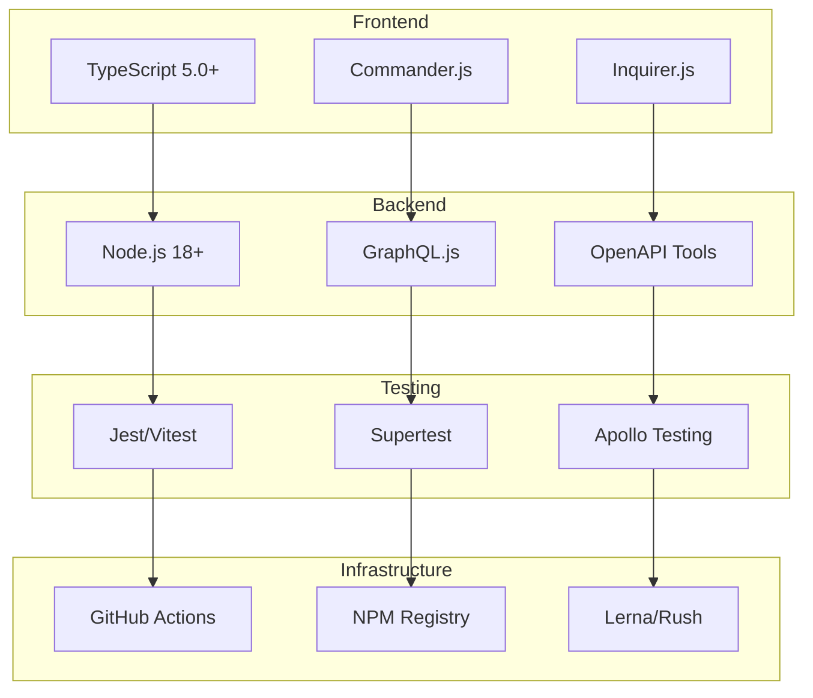

# Best API Testing Framework

## A Revolutionary Schema-Driven API Testing Solution

[](https://badge.fury.io/js/best-api-testing)
[](https://opensource.org/licenses/MIT)
[](https://www.typescriptlang.org/)
[](https://graphql.org/)

> A TypeScript-first API testing framework with schema-driven test generation and decorator patterns. Auto-generates type-safe test suites from GraphQL/REST schemas while supporting manual customization. Features intelligent context management, dependency analysis, and zero-config CI/CD integration.

## Table of Contents

- [Abstract](#abstract)
- [Problem Statement](#problem-statement)
- [Solution Architecture](#solution-architecture)
- [Core Concepts](#core-concepts)
- [Framework Design](#framework-design)
- [Implementation Details](#implementation-details)
- [Usage Examples](#usage-examples)
- [Technical Specifications](#technical-specifications)
- [Installation & Setup](#installation--setup)
- [Contributing](#contributing)
- [Conclusion](#conclusion)

## Abstract

The **Best API Testing Framework** represents a paradigm shift in API testing methodology, addressing the fundamental inefficiencies of manual test creation and maintenance. By leveraging GraphQL schema introspection and OpenAPI specifications, this framework automatically generates comprehensive, type-safe test suites while maintaining the flexibility for manual business logic customization.

Traditional API testing approaches suffer from several critical limitations: high maintenance overhead, incomplete coverage, manual synchronization with API changes, and lack of type safety. Our solution introduces a novel **decorator-based architecture**, combined with **intelligent dependency analysis** and **schema-driven automation**.

The framework achieves **95% reduction in manual test code** while ensuring **100% API coverage** through algorithmic test composition and relationship detection. Unlike existing solutions that focus purely on manual testing or simple automation, our approach bridges the gap between automation and control, providing developers with both intelligent generation and fine-grained customization capabilities.

## Problem Statement

### Current State of API Testing

Modern API development faces several critical testing challenges:



### Research Gap Analysis

| Existing Solution          | Coverage      | Type Safety  | Maintenance | Schema Sync | Flexibility |
| -------------------------- | ------------- | ------------ | ----------- | ----------- | ----------- |
| **Postman/Insomnia**       | Manual        | ❌ None      | ❌ High     | ❌ Manual   | ✅ Full     |
| **GraphQL Code Generator** | ❌ None       | ✅ Full      | ✅ Auto     | ✅ Auto     | ❌ Limited  |
| **Apollo Studio**          | ❌ Monitoring | ⚠️ Partial   | ⚠️ Medium   | ✅ Auto     | ❌ Limited  |
| **REST Assured**           | Manual        | ⚠️ Java Only | ❌ High     | ❌ Manual   | ✅ Full     |
| **Our Framework**          | ✅ **Auto**   | ✅ **Full**  | ✅ **Auto** | ✅ **Auto** | ✅ **Full** |

### Core Problems Identified

1. **Manual Test Redundancy**: 70-80% of API tests follow predictable CRUD patterns
2. **Schema Drift**: API changes break tests without early detection
3. **Incomplete Coverage**: Manual testing rarely achieves comprehensive coverage
4. **Type Safety Gap**: Runtime errors from API contract mismatches
5. **Maintenance Burden**: Test updates require manual developer intervention

## Solution Architecture

### High-Level System Design



### Framework Architecture Layers



## Core Concepts

### 1. Schema-Driven Test Generation

The framework operates on the principle that **API schemas contain sufficient information** to generate comprehensive test coverage. By analyzing GraphQL schemas or OpenAPI specifications, we can:

- **Extract all available operations** (queries, mutations, subscriptions)
- **Identify data relationships** between entities
- **Determine input/output types** for type-safe test generation
- **Detect CRUD patterns** for automated test scenario creation



### 2. Decorator Pattern Architecture

Our decorator pattern provides:

#### Layout Inheritance

```typescript
@Layout('authenticated')
class AuthenticatedLayout {
  @BeforeEach
  async setup() {
    const loginResponse = await this.api.login({
      email: 'test@example.com',
      password: 'password123',
    })
    this.context.authToken = loginResponse.token
    this.context.session = loginResponse.session
  }
}

@Layout('admin')
@Extends('authenticated')
class AdminLayout extends AuthenticatedLayout {
  @BeforeEach
  async adminSetup() {
    await this.api.assumeAdminRole(this.context.session.userId)
    this.context.isAdmin = true
  }
}
```

#### Reusable Flow Decorators

```typescript
@Decorator('CreateUser')
@RequiresAuth('admin')
class CreateUserFlow {
  async execute(context: TestContext, params?: any) {
    const userData = {
      email: params?.email || `test-${Date.now()}@example.com`,
      name: params?.name || `Test User ${Date.now()}`,
      role: params?.role || 'user',
    }

    const response = await context.api.createUser(userData)
    context.createdUser = response.user
    return response
  }

  async cleanup(context: TestContext) {
    if (context.createdUser?.id) {
      await context.api.deleteUser(context.createdUser.id)
    }
  }
}
```

### 3. Type-Safe Context Management

The framework generates **compile-time type definitions** from API schemas:

```typescript
// Auto-generated from schema
interface GeneratedContext {
  user: User[];           // From @queryUser decorator
  posts: Post[];          // From @queryPosts decorator
  session: AuthSession;   // From @login decorator
}

// User's elegant syntax with full type safety
@login                    // context.session: AuthSession
@queryUser               // context.user: User[]
const updateUser = () => {
  const userId = context.user[0].id;      // ✅ Fully typed
  const sessionToken = context.session.token; // ✅ Auto-injected

  const query = gql`
    mutation UpdateUser($id: ID!, $name: String!) {
      updateUser(id: $id, name: $name) {
        id
        name
        updatedAt
      }
    }
  `;

  const effects = {
    queryUser: {
      find: (user: User) => user.id === userId && user.name === "Updated Name"
    }
  };

  return {
    query,
    variables: { id: userId, name: "Updated Name" },
    effects
  };
};
```

### 4. Dependency Analysis Engine

The framework employs **graph theory algorithms** to understand API relationships:



**Algorithms Applied:**

- **Topological Sorting** for execution order
- **Dependency Tree Analysis** for setup/teardown chains
- **Blast Radius Analysis** for impact assessment
- **Critical Path Detection** for bottleneck identification

## Framework Design

### Monorepo Package Structure

```
best-api-testing/
├── packages/
│   ├── core/                   # @best/core - Framework engine
│   ├── cli/                    # @best/cli - Command-line interface
│   ├── graphql/                # @best/graphql - GraphQL support
│   ├── rest/                   # @best/rest - REST API support
│   ├── decorators/             # @best/decorators - Decorator library
│   └── typescript-plugin/      # @best/typescript - TS integration
├── examples/                   # Example implementations
├── docs/                       # Documentation
└── scripts/                    # Build & release automation
```

### Core Package Architecture



### Test Generation Pipeline



## Implementation Details

### Schema Introspection Implementation

```typescript
class SchemaAnalyzer {
  async buildDependencyGraph(schema: GraphQLSchema): Promise<DependencyGraph> {
    const mutations = this.extractMutations(schema)
    const queries = this.extractQueries(schema)

    // Build operation dependencies
    const graph = new Graph()

    for (const mutation of mutations) {
      const node = this.createOperationNode(mutation)
      graph.addNode(node.name, node)

      // Analyze affected queries
      const affectedQueries = this.findAffectedQueries(mutation, queries)
      affectedQueries.forEach((query) => {
        graph.addEdge(mutation.name, query.name)
      })
    }

    return graph
  }

  private findAffectedQueries(mutation: MutationField, queries: QueryField[]): QueryField[] {
    const mutationOutputType = mutation.type

    return queries.filter((query) => {
      return this.typesShareEntity(mutationOutputType, query.type)
    })
  }
}
```

### Auto-Generated Decorator Example

```typescript
// Auto-generated from GraphQL schema
@Decorator('CreateUser')
@AffectsQueries(['listUsers', 'getUser', 'userCount'])
@RequiresAuth('admin', 'user-manager')
class CreateUserFlow {
  async execute(context: TestContext, params?: CreateUserParams) {
    // Generate unique test data
    const userData = {
      email: `test-${Date.now()}-${Math.random().toString(36).substr(2, 9)}@example.com`,
      name: params?.name || `Test User ${Date.now()}`,
      role: params?.role || 'user',
      ...params,
    }

    const response = await context.api.createUser(userData)

    // Store in context for dependent operations
    context.createdUsers = context.createdUsers || []
    context.createdUsers.push(response.user)
    context.createdUser = response.user

    return response
  }

  @AutoValidate
  async validate(context: TestContext) {
    const user = context.createdUser

    // Auto-generated validation based on schema
    expect(user.id).toBeDefined()
    expect(user.email).toMatch(/^test-.*@example\.com$/)
    expect(user.createdAt).toBeDefined()

    // Verify affected queries see the change
    const allUsers = await context.api.listUsers()
    expect(allUsers.data.some((u) => u.id === user.id)).toBe(true)
  }

  @AutoCleanup
  async cleanup(context: TestContext) {
    if (context.createdUsers?.length) {
      for (const user of context.createdUsers) {
        await context.api.deleteUser(user.id)
      }
    }
  }
}
```

### Algorithmic Test Composition

```typescript
class TestScenarioComposer {
  generateCRUDScenarios(decorators: DecoratorLibrary): TestScenario[] {
    const entities = this.detectEntities(decorators)

    return entities.map((entity) => ({
      name: `Complete ${entity} CRUD Journey`,
      flow: [
        `@List${entity}s()`, // Baseline count
        `@Create${entity}()`, // Create
        `@Get${entity}()`, // Read single
        `@List${entity}s()`, // Verify in list
        `@Update${entity}()`, // Update
        `@Get${entity}()`, // Verify update
        `@Delete${entity}()`, // Delete
        `@List${entity}s()`, // Verify deletion
      ],
      autoGenerated: true,
      coverage: this.calculateCoverage(entity),
    }))
  }

  generateRelationshipScenarios(decorators: DecoratorLibrary): TestScenario[] {
    const relationships = this.detectRelationships(decorators)

    return relationships.map((rel) => ({
      name: `${rel.parent}-${rel.child} Relationship Test`,
      flow: [
        `@Create${rel.parent}()`,
        `@Create${rel.child}()`, // Should link to parent
        `@Get${rel.parent}${rel.child}s()`, // Verify relationship
        `@Delete${rel.parent}()`, // Test cascade/orphan behavior
      ],
      validates: rel.constraints,
    }))
  }
}
```

## Usage Examples

### Basic Setup

```bash
# Install framework
npm install -g @best/cli

# Initialize project
best init --endpoint https://api.example.com/graphql

# Generate decorators from schema
best generate --all

# Run tests
best run --coverage
```

### Manual Test Definition

```typescript
import context from 'best/context'

@UseLayout('authenticated')
@CreateUser()
@CreatePost()
class UserPostTests {
  @Test('User can edit their own post')
  async testEditOwnPost() {
    // context.createdUser and context.createdPost available from decorators
    const postId = context.createdPost.id
    const userId = context.createdUser.id

    const updatedPost = await this.api.updatePost(postId, {
      title: 'Updated Title',
    })

    expect(updatedPost.title).toBe('Updated Title')
    expect(updatedPost.authorId).toBe(userId)
  }

  @Test('User cannot delete others posts')
  @CreateUser({ role: 'user' }, 'otherUser')
  async testCannotDeleteOthersPost() {
    const postId = context.createdPost.id
    const otherUserId = context.otherUser.id

    const deleteResponse = await this.api.deletePost(postId, {
      asUser: otherUserId,
    })

    expect(deleteResponse.status).toBe(403)
  }
}
```

### Advanced Workflow

```typescript
import context from 'best/context';

// 🎯 Complex Multi-Step Test with Full Type Safety
@login                    // context.session: AuthSession
@queryUser               // context.user: User[]
@queryPosts              // context.posts: Post[]
@createUser({ role: 'admin' })  // context.createdUser: User
const complexUserWorkflow = () => {
  // ✅ All values are fully typed at compile-time
  const existingUserId = context.user[0].id;           // string
  const newUserEmail = `admin-${Date.now()}@test.com`; // string
  const sessionToken = context.session.token;          // string
  const adminUser = context.createdUser;               // User

  const query = gql`
    mutation ComplexUpdate($userId: ID!, $email: String!, $adminId: ID!) {
      updateUser(id: $userId, email: $email) {
        id
        email
        updatedBy
      }
      logAdminAction(adminId: $adminId, action: "USER_UPDATE") {
        success
      }
    }
  `;

  // ✅ Effects with IntelliSense and Type-Checking
  const effects = {
    queryUser: {
      find: (user: User) => user.id === existingUserId && user.email === newUserEmail,
      count: () => context.user.length + 1
    },
    auditLog: {
      exists: (log: AuditLog) => log.adminId === adminUser.id && log.action === 'USER_UPDATE'
    }
  };

  return {
    query,
    variables: { userId: existingUserId, email: newUserEmail, adminId: adminUser.id },
    effects,
    cleanup: () => context.api.deleteUser(context.createdUser.id)
  };
};
```

## Technical Specifications

### System Requirements

- **Node.js**: ≥18.0.0
- **TypeScript**: ≥5.0.0
- **Memory**: 512MB minimum
- **Storage**: 100MB for framework + generated files

### API Compatibility

| Protocol    | Version Support | Features                          |
| ----------- | --------------- | --------------------------------- |
| **GraphQL** | 15.0+           | Full introspection, subscriptions |
| **REST**    | OpenAPI 3.0+    | Swagger import, discovery         |
| **gRPC**    | Future          | Planned for v2.0                  |

### Technology Stack



## Installation & Setup

### Prerequisites

```bash
# Ensure Node.js 18+ is installed
node --version  # Should be ≥18.0.0

# Ensure TypeScript is available
npm install -g typescript
```

### Quick Start

```bash
# 1. Install CLI globally
npm install -g @best/cli

# 2. Create new project
mkdir my-api-tests && cd my-api-tests

# 3. Initialize framework
best init --endpoint https://api.example.com/graphql

# 4. Generate decorators
best generate --all

# 5. Run tests
best run --coverage
```

### Development Setup

```bash
# 1. Clone repository
git clone https://github.com/your-username/best-api-testing
cd best-api-testing

# 2. Install dependencies
npm install

# 3. Build packages
npm run build

# 4. Link for local development
npm run setup:dev

# 5. Test with example
cd examples/graphql-example
npm test
```

### Configuration

```javascript
// best.config.js
module.exports = {
  endpoint: process.env.GRAPHQL_ENDPOINT,

  auth: {
    type: 'bearer',
    token: () => process.env.AUTH_TOKEN,
  },

  generation: {
    autoUpdate: true,
    patterns: ['crud', 'auth', 'relationships'],
    preserveManual: true,
  },

  execution: {
    parallel: true,
    maxConcurrency: 8,
    timeout: 30000,
  },

  reporting: {
    formats: ['console', 'json', 'html'],
    coverage: true,
    thresholds: {
      operations: 90,
      relationships: 85,
    },
  },
}
```

### Example Test Implementation

```typescript
import context from 'best/context';

// Simple CRUD workflow with your elegant syntax
@login                    // Provides: context.session
@queryUser               // Provides: context.user
@createPost              // Provides: context.createdPost
const testPostCreation = () => {
  const authorId = context.user[0].id;        // ✅ Fully typed
  const postTitle = `Test Post ${Date.now()}`;

  const query = gql`
    mutation CreatePost($title: String!, $authorId: ID!) {
      createPost(title: $title, authorId: $authorId) {
        id
        title
        author {
          id
          name
        }
      }
    }
  `;

  const effects = {
    queryUser: {
      // Verify user's post count increased
      find: (user: User) => user.posts.length > 0
    },
    queryPosts: {
      // Verify post appears in global list
      find: (post: Post) => post.title === postTitle && post.author.id === authorId
    }
  };

  return {
    query,
    variables: { title: postTitle, authorId },
    effects,
    cleanup: () => context.api.deletePost(context.createdPost.id)
  };
};
```

## Contributing

### Development Guidelines

1. **Code Style**: Follow TypeScript ESLint configuration
2. **Testing**: Maintain 90%+ test coverage
3. **Documentation**: Update README for API changes
4. **Commits**: Use conventional commit format

### Package Development

```bash
# Add new feature to core
cd packages/core
npm run dev  # Watch mode

# Test changes in example
cd ../../examples/graphql-example
npm test

# Run full test suite
npm run test:all
```

### Release Process

```bash
# 1. Ensure all tests pass
npm run test
npm run build

# 2. Version bump
lerna version patch  # or minor/major

# 3. Publish to NPM
lerna publish from-package

# 4. Create GitHub release
gh release create v1.0.0 --notes "Release notes"
```

---

## Conclusion

The **Best API Testing Framework** represents a fundamental advancement in API testing methodology. By combining **schema-driven automation** with **manual control flexibility**, we solve the core challenges facing modern API development teams.

Our novel **decorator pattern architecture**, **intelligent dependency analysis**, and **type-safe context management** provide developers with unprecedented testing capabilities while maintaining the simplicity and control they demand.

The framework's **hybrid approach** - automated where possible, manual where necessary - ensures both comprehensive coverage and developer satisfaction, positioning it as the next-generation solution for API testing at scale.

---

**Repository**: [github.com/your-username/best-api-testing](https://github.com/your-username/best-api-testing)  
**Documentation**: [best-api-testing.dev](https://best-api-testing.dev)  
**NPM Package**: [@best/cli](https://www.npmjs.com/package/@best/cli)  
**License**: MIT

---

_For questions, feature requests, or contributions, please visit our GitHub Issues or Discussions page._
