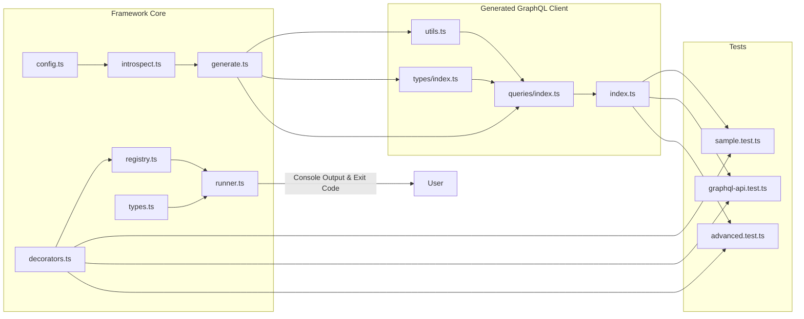
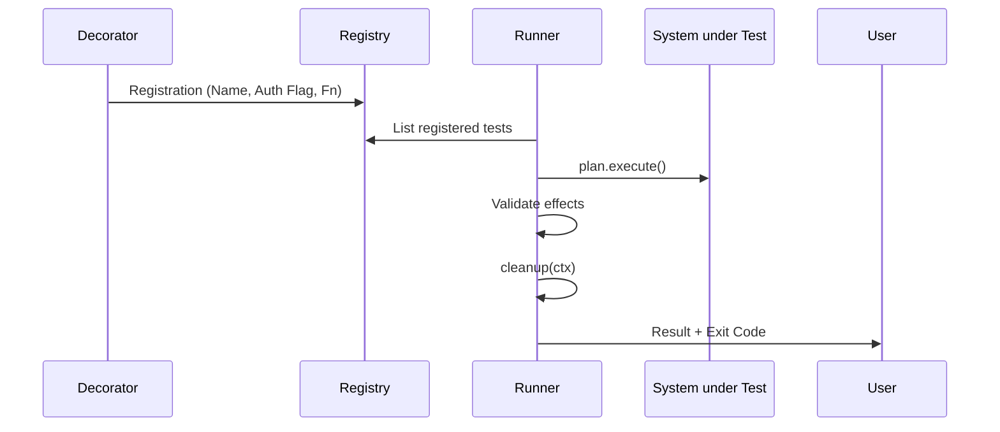

# Best API Testing Framework

> A lightweight, schema-driven integration testing framework for GraphQL with TypeScript, decorator API, generated client, and declarative effects.

## Abstract

This framework automates the essential steps of GraphQL integration testing: from schema introspection through generation of a type-safe client to execution of declarative test plans. The architecture combines minimal but precise code generation (queries/types/utils) with an elegant decorator syntax (`@Test`, `@AuthenticatedTest`) and an effects system for traceable, meaningful assertions. The goal is to reduce testing overhead, promote reusability, and ensure type safety and maintainability.

## Table of Contents

- [Motivation and Problem Statement](#motivation-and-problem-statement)
- [System Overview](#system-overview)
- [Architecture](#architecture)
- [Implementation Details](#implementation-details)
- [Installation and Quick Start](#installation-and-quick-start)
- [Configuration](#configuration)
- [Decorators and Test DSL](#decorators-and-test-dsl)
- [Generated GraphQL Client](#generated-graphql-client)
- [Examples](#examples)
- [CLI and Workflows](#cli-and-workflows)
- [Limitations and Roadmap](#limitations-and-roadmap)
- [License](#license)

## Motivation and Problem Statement

Manual API tests often suffer from high maintenance overhead, lack of type safety, and unclear separation of execution, validation, and cleanup logic. However, GraphQL schemas already contain the necessary structure to automate much of the test boilerplate. This project addresses:

1. **Reduction of redundant test logic** through a generated, type-safe client
2. **Clearly defined, declarative effects** (assertions) with meaningful error messages
3. **Repeatable test flows** (execute, effects, cleanup) with easy extensibility

## System Overview

```mermaid
flowchart TD
    A[GraphQL Endpoint] --> B[Introspection]
    B --> C[TypeScript Codegen\n(Types, Queries, Utils)]
    C --> D[Test Implementation\n(Decorators, Test Plans)]
    D --> E[Runner\n(Execute, Effects, Cleanup)]
    E --> F[Reports\n(Console, Exit Code)]
```

**Key Features:**

- **Schema-driven code generation** (minimal but targeted, deliberately lightweight)
- **Declarative tests** with clear separation of execution, validation, and cleanup
- **Configurable authentication** (none, basic, bearer) and headers
- **Type-safe GraphQL client** with minimal selection sets
- **Zero external test framework dependencies**

## Architecture



**Layered Architecture:**

- **Infrastructure Layer**: Introspection and code generation
- **Domain Layer**: Test plans, decorators, registry, runner
- **Generated Artifacts**: Type-safe client (queries, types, utils)

## Implementation Details

- **Configuration**: `src/framework/config.ts` loads `integration-test.config.json` (with dotenv support), options include endpoint, auth, headers, `schemaFile`, `generatedDir`.
- **Introspection**: `src/framework/introspect.ts` executes the standardized GraphQL introspection query and persists the schema (JSON).
- **Code Generation**: `src/framework/generate.ts` creates:

  - **Types** (`src/graphql/types/index.ts`)
  - **Query Wrappers** (`src/graphql/queries/index.ts`)
  - **Utils** (`src/graphql/utils.ts`) including auth header handling
  - **Index** (`src/graphql/index.ts`)

  Selection sets are deliberately minimal (scalar fields), recursion depth is limited (performance/robustness).

- **Test Execution**: `src/framework/runner.ts` loads registered tests, executes `execute`, validates `effects`, optionally calls `cleanup`, and sets exit code.
- **Decorators/Registry**: `@Test` and `@AuthenticatedTest` register methods in `TestRegistry` (`src/framework/registry.ts`).

**Test Execution Flow:**



## Installation and Quick Start

**Prerequisites**: Node.js ≥ 18, npm

```bash
npm install
npm run build

# 1) Schema introspection + code generation
npm run init:introspection

# 2) Run tests
npm run test:int
```

**Development mode without build** (optional):

```bash
# Example: direct CLI usage via tsx
npx tsx src/cli.ts init
npx tsx src/cli.ts run --pattern=pizza
```

## Configuration

**File**: `integration-test.config.json`

```json
{
  "endpoint": "http://localhost:3000/graphql",
  "auth": { "type": "none" },
  "headers": { "x-trace": "dev" },
  "schemaFile": "schema.json",
  "generatedDir": "src/graphql"
}
```

**Supported Authentication:**

- `none`
- `basic`: `{ "type": "basic", "username": "...", "password": "..." }`
- `bearer`: `{ "type": "bearer", "token": "..." }`

Additional headers are passed directly to GraphQL requests.

## Decorators and Test DSL

**Test Declaration** (simplified example):

```ts
import { Test } from "../framework/decorators.js";
import { queries, types } from "../graphql/index.js";

export class GraphQLAPITests {
  @Test
  static queryAllPizzas() {
    return {
      execute: async () => {
        const data = await queries.pizzas();
        return { pizzas: data } as { pizzas: types.Pizza[] };
      },
      effects: [
        {
          name: "pizzas-not-empty",
          validate: (ctx) => ctx.pizzas.length > 0,
          onFailureMessage: "Expected at least one pizza",
        },
      ],
    };
  }
}
```

**TestPlan Types** (`src/framework/types.ts`):

- `execute`: `() => Promise<TContext> | TContext`
- `effects`: `Array<{ name, validate(ctx), onFailureMessage? }>`
- `cleanup`: Optional cleanup step with access to context

`onFailureMessage` accepts either a string or function `(ctx) => string`.

## Generated GraphQL Client

**Structure** (generated after introspection):

```
src/graphql/
├── index.ts        # Exports (types, queries, utils)
├── utils.ts        # call<T>(query, variables) including auth handling
├── types/
│   └── index.ts    # Interfaces (Order, Pizza, ...)
└── queries/
    └── index.ts    # Query functions (orders, pizzas, ...)
```

**Features:**

- **Minimal but type-safe** wrapper functions per root field
- **Automatic mapping** of common scalars (ID/String/Int/Float/Boolean)
- **Selection sets**: scalar fields of return type (recursively limited)
- **Zero runtime dependencies** beyond the framework core

## Examples

**Sample test output:**

```bash
✔ queryAllPizzas (67ms)
✔ queryAllOrders (29ms)
🧹 Cleanup: tested pizza "bbq_ckn_s"
✔ testSinglePizzaRetrieval (72ms)
✔ basicTest (0ms)
4/4 passed
```

**Example: End-to-End flow with cleanup:**

```ts
@Test
static async testSinglePizzaRetrieval() {
  return {
    execute: async () => {
      const allPizzas = await queries.pizzas();
      const singlePizza = await queries.pizza({ id: allPizzas[0].id });
      return { allPizzas, singlePizza, testedId: allPizzas[0].id };
    },
    effects: [
      {
        name: "single-pizza-matches-id",
        validate: (ctx) => ctx.singlePizza.id === ctx.testedId,
        onFailureMessage: (ctx) =>
          `Expected pizza ID ${ctx.testedId} but got ${ctx.singlePizza.id}`
      }
    ],
    cleanup: async (ctx) => {
      console.log(`🧹 Cleanup: tested pizza "${ctx.singlePizza.id}"`);
    }
  };
}
```

**Basic test example:**

```ts
@Test
static basicTest() {
  return {
    execute: () => {
      return { message: "Test executed" };
    },
    effects: [
      {
        name: "always-pass",
        validate: (ctx: { message: string }) =>
          ctx.message === "Test executed",
      },
    ],
  };
}
```

## CLI and Workflows

- **Initialization** (introspection + code generation): `npm run init:introspection`
- **Run tests**: `npm run test:int`
- **Optional filter**: `node dist/cli.js run --pattern=pizza`
- **Check configuration**: `node dist/cli.js print-config`
- **Development mode**: `npm run dev` (watch mode with tsx)

The runner loads tests from `dist/tests/*.js`. Always build first (`npm run build`).

**Available CLI commands:**

```bash
# Initialize schema and generate client
npx tsx src/cli.ts init

# Run all tests
npx tsx src/cli.ts run

# Run tests matching pattern
npx tsx src/cli.ts run --pattern=pizza

# Print current configuration
npx tsx src/cli.ts print-config
```

## Limitations and Roadmap

**Current focus** is on clarity and low complexity:

- **Selection sets** are limited to scalar fields; recursion depth is bounded
- Currently only **query generation** is utilized; mutation wrappers are prepared
- **No external test framework** needed; simple, standalone execution
- **Minimal dependencies**: Only GraphQL introspection, fetch, and TypeScript

**Possible enhancements:**

- **Extended selection strategies** (relational paths, fragments)
- **Mutation flows** including automatic cleanup hooks
- **Coverage and reporting** improvements
- **Watch mode** for continuous testing during development
- **Custom scalar mappings** and advanced type generation

## License

MIT License. See `LICENSE`.
